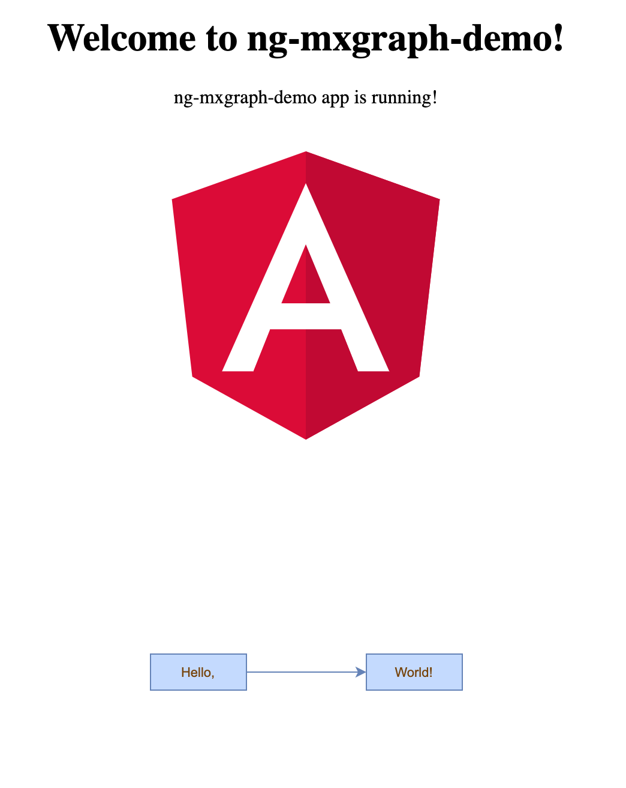

# Angular + mxGraph + mxGraph Types

### A simple example of how to integrate Angular with mxGraph and setup types for it.

#### 1. Create basic Angular project via CLI (minimal mode with routing and scss for demo purposes)

```
ng new ng-mxgraph-demo --minimal
```

#### 2. Install mxGraph

```
npm install mxgraph
```

#### 3. Setup mxGraph config and bundling

##### Update angular.json file **assets** section to include mxGraph assets.

```json
"assets": [
    "src/favicon.ico",
    "src/assets",
    {
        "glob": "**/*",
        "input": "./node_modules/mxgraph/javascript/src",
        "output": "./assets/mxgraph"
    }
]
```

##### Create src/config/mxgraph-config.js file to store mxGraph related configurations and set mxBasePath value.

```js
mxBasePath = "assets/mxgraph";
```

##### Update angular.json file **scripts** section to include mxGraph and its config file in a result bundle.

```json
"scripts": [
    "src/config/mxgraph-config.js",
    "node_modules/mxgraph/javascript/mxClient.js"
]
```

#### 4. Install mxGraph types

```
npm install mxgraph-type-definitions --save-dev
```

#### 5. Setup mxGraph types

##### Update typeRoots section of [tsconfig.json](https://github.com/ivamax9/angular-mxgraph-demo/commit/aa60e1afe4a298fa9673435af9a96cbb8178540d)
```ts
"typeRoots": [
  "node_modules/mxgraph-type-definitions",
  "node_modules/@types"
]
```
###### In minimal mode, Angular CLI doesn't create tsconfig.json file. Just copy [tsconfig.json](https://github.com/ivamax9/angular-mxgraph-demo/blob/master/tsconfig.json) to src folder from the repo.

##### Remove types section from [tsconfig.app.json](https://github.com/ivamax9/angular-mxgraph-demo/commit/aa60e1afe4a298fa9673435af9a96cbb8178540d) in order to skip override of typeRoots in tsconfig.json.

##### As a result, mxGraph types become global and there is no need to import them. 

#### 6. Create a demo component

##### Generate demo component and implement ["Hello World"](https://github.com/jgraph/mxgraph/blob/master/javascript/examples/helloworld.html) example

```
ng g c demo --skipTests=true
```

##### Update demo.component.html

```html
<div id="demoGraph">
  <div #graphContainer></div>
</div>
```

##### Update demo.component.scss

```scss
#demoGraph {
  display: flex;
  flex-direction: row;
  flex-wrap: wrap;
  justify-content: center;
  align-items: center;
}
```

##### Update demo.component.ts

```ts
import { Component, ElementRef, ViewChild, AfterViewInit } from "@angular/core";

@Component({
  selector: "demo",
  templateUrl: "./demo.component.html",
  styleUrls: ["./demo.component.scss"],
})
export class DemoComponent implements AfterViewInit {
  @ViewChild("graphContainer") containerElementRef: ElementRef;

  get container() {
    return this.containerElementRef.nativeElement;
  }

  ngAfterViewInit(): void {
    // Disables the built-in context menu
    mxEvent.disableContextMenu(this.container);
    // Creates the graph inside the given container
    const graph = new mxGraph(this.container);
    // Enables rubberband selection
    new mxRubberband(graph);
    // Gets the default parent for inserting new cells. This
    // is normally the first child of the root (ie. layer 0).
    const parent = graph.getDefaultParent();
    // Adds cells to the model in a single step
    graph.getModel().beginUpdate();
    try {
      const helloBlock = graph.insertVertex(parent, null, "Hello,", 20, 150, 80, 30);
      const worldBlock = graph.insertVertex(parent, null, "World!", 200, 150, 80, 30);
      graph.insertEdge(parent, null, "", helloBlock, worldBlock);
    } finally {
      // Updates the display
      graph.getModel().endUpdate();
    }
  }
}
```

##### Update app-routing.module.ts

```ts
import { NgModule } from '@angular/core';
import { Routes, RouterModule } from '@angular/router';

import { DemoComponent } from './demo/demo.component';

const routes: Routes = [
  {
    path: 'demo',
    component: DemoComponent
  }
];

@NgModule({
  imports: [RouterModule.forRoot(routes)],
  exports: [RouterModule]
})
export class AppRoutingModule { }

```

#### 7. Run the project and navigate to http://localhost:4200/demo



### Reference material
* [Official mxGraph repository](https://github.com/jgraph/mxgraph)
* [mxGraph Types community repo](https://github.com/process-analytics/mxgraph-road-to-DefinitelyTyped)
* [Another Angular mxGraph demo from @diegogusava](https://github.com/diegogusava/angular-mxgraph)